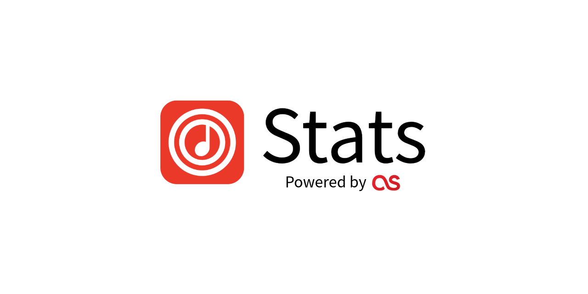

Echo Charts is a lightning-fast, beautifully designed global music dashboard that visualizes real-time trending tracks, artists, and albums using pure, unfiltered listening data. Part of the Echo Music ecosystem.

## Features

- **Global & Regional Data:** View trending tracks across the globe or filter by specific countries.
- **Genre Spotlight:** Discover the most streamed tracks in Bollywood, K-Pop, Hip-Hop, Electronic, and more.
- **Time Machine:** Travel back in time and view charts from the 2010s, 2000s, and 1990s.
- **Rich Media & Audio:** Hover over track cards to instantly play a high-quality audio preview.
- **No Algorithmic Bias:** Pure data visualization of what the world is listening to right now, unmanipulated by algorithms.
- **Session Caching:** Intelligent `sessionStorage` layer guarantees blazing fast reloads and prevents IP-based rate limiting from external APIs.

## Getting Started

Because Echo Charts is a pure frontend application, there are no build steps, dependencies, or node modules required to run it!

1. **Clone the repository**
   ```bash
   git clone https://github.com/yourusername/echo-charts.git
   cd echo-charts
   ```

2. **Run it locally**
   - You can simply double-click `index.html` to open it in your browser.
   - Or, run a simple local server:
     ```bash
     npx serve .
     # or
     python3 -m http.server
     ```

## API Integration

Are you building an app and want to use this data? Echo Charts exposes its documentation for developers.
Check out the **[API Docs](docs.html)** page to learn how you can leverage our endpoints for:
- `/api/v1/trending`
- `/api/v1/timemachine`

## License & Legal

- **Data Attribution:** Echo Charts does not host or hold any audio content. All data, artwork, and audio previews are retrieved live via Last.fm and iTunes APIs.
- **Legal:** Please see our [Privacy Policy](privacy.html) and [Terms & Conditions](terms.html) for more information.

---

*Not pushed by algorithm or AI. It's just raw data the users are listening to.*
